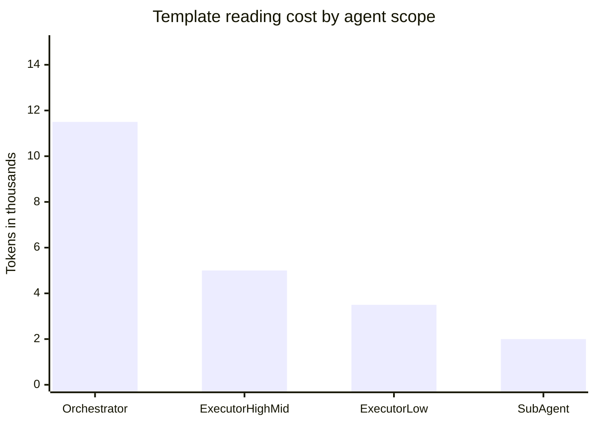
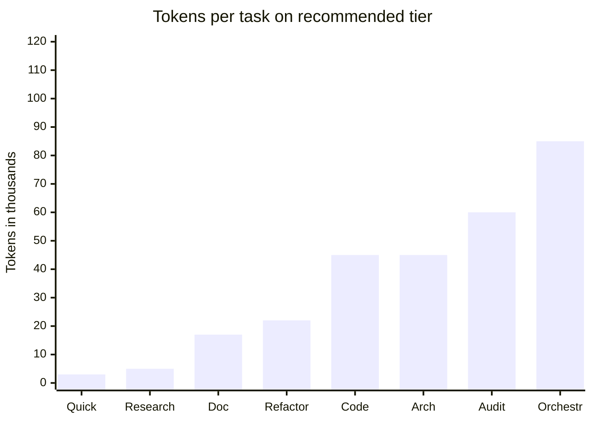
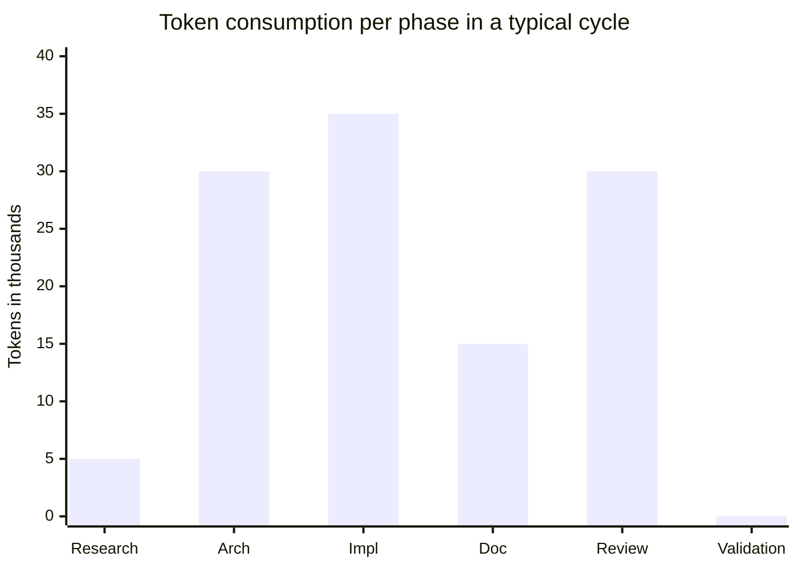
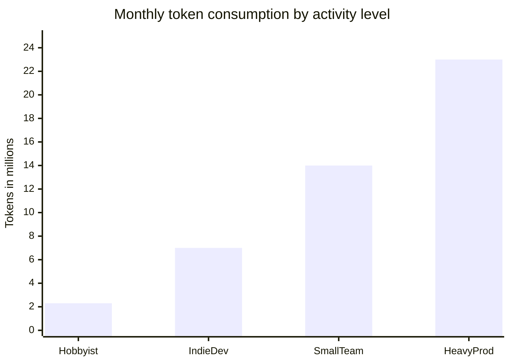

---
tags:
  - agent/docs
  - token-economy
  - v2-public
version: 1.0.0
created: 2026-04-15
updated: 2026-04-15
author: "{{OPERATOR_NAME}}"
description: Token consumption projections for the claude-root-orchestrator V2 template by task type and model tier
---

# Token Economy — Consumption Projections

> How much does this template cost in tokens ? This document gives you rough estimates based on typical usage patterns. Dollar cost is intentionally omitted ; use these numbers with your provider's pricing to compute actual cost.

---

## 1. Template reading cost (per agent scope)

The `<scope-doctrine>` rule in AGENT.md ensures each agent loads only what it needs — the template cost is amortized across the session.

| Agent scope | Files loaded | Tokens input (approx) | % of 200k context |
|-------------|--------------|-----------------------|-------------------|
| Orchestrator (high-tier) | AGENT.md + ORCHESTRATEUR.md + LLM-ARCHITECTURE.md (+ optional README.md) | **~10,000 - 13,300** | 5 - 6.7 % |
| Executor high/mid-tier (non-orchestrator) | AGENT.md (universal) + agent-specific prompt | **~4,500 - 5,500** | 2.3 - 2.8 % |
| Executor low-tier (Haiku-equivalent) | AGENT.md (universal-rules only) + role prompt | **~3,000 - 4,000** | 1.5 - 2.0 % |
| Sub-agent (spawned via Task tool) | Injected prompt only (universal-backlog-trace applies) | **~1,500 - 2,500** | 0.75 - 1.25 % |

**Key insight** : the template load is a **one-time cost per session**, then reused in context. The marginal cost per additional agent spawn within the same session is much lower.

### Visual : template reading cost by agent type

---

## 2. Per-task × tier consumption matrix

The following matrix gives rough per-iteration tokens (input + output combined) for each common task type, cross-referenced by model tier. Ranges reflect typical variation based on task complexity.

| Task type | Low-tier (k tokens) | Mid-tier (k tokens) | High-tier (k tokens) | Best fit |
|-----------|---------------------|----------------------|----------------------|----------|
| Quick lookup / DISCUSSION | **2 - 4** | 3 - 6 | (waste of tier) | low |
| External research synthesis | **3 - 7** | 5 - 12 | (waste) | low / external |
| Documentation writing | (insufficient quality) | **10 - 25** | 15 - 30 | mid |
| Light refactoring | (insufficient quality) | **15 - 30** | 25 - 45 | mid |
| Code generation | (not recommended) | 20 - 40 | **30 - 60** | high |
| Architecture design (ADR + C4 + RBAC) | (insufficient quality) | (insufficient quality) | **30 - 60** | high |
| Security audit (STRIDE, threat model) | (insufficient quality) | (insufficient quality) | **40 - 80** | high |
| Multi-agent orchestration (meta) | (cannot orchestrate per `haiku-no-delegation`) | 40 - 80 | **50 - 120** | high (mid acceptable) |

**Legend** : in **bold** the recommended tier. "Insufficient quality" means the tier is technically capable of the task but produces unreliable or incomplete output ; "waste of tier" means the task does not require that tier's capabilities.

### Visual : tokens per task type (recommended tier)

---

## 3. Typical 6-phase full cycle (multi-agent workflow)

A complete feature development cycle following the **"Code with Review"** method documented in [`LLM-ARCHITECTURE.md`](./LLM-ARCHITECTURE.md) section `<development-workflow>`.

| Phase | Agent tier | Typical tokens | Notes |
|-------|------------|----------------|-------|
| 1. Research | external (Perplexity/Gemini) | ~5 k | Web lookup + synthesis in `.claude/context/research-*.md` |
| 2. Architecture | high-tier (Winston persona) | ~30 k | ADR + C4 diagrams + RBAC matrix |
| 3. Implementation | high-tier (Amelia/Winston) | ~35 k | Production code + unit tests |
| 4. Documentation | mid-tier (Paige) | ~15 k | README updates + inline docs + changelog |
| 5. Review / Audit | high-tier (Quinn/Sam) | ~30 k | Code review + threat model + RBAC validation |
| 6. Operator validation | human | 0 k | Manual approval in chat |
| **Full cycle total** | mixed | **~115 k tokens** | 1 feature end-to-end |

### Visual : tokens distribution across the 6-phase cycle

---

## 4. Session volume scenarios

How many cycles you run per day × the cost per cycle gives your monthly token budget.

| Activity level | Cycles / week | Monthly tokens | Typical user profile |
|----------------|---------------|----------------|----------------------|
| Hobbyist / weekend projects | 5 | ~2.3 M | Occasional exploration |
| Indie dev / freelancer | 15 | ~7 M | Regular development |
| Small team / active consultancy | 30 | ~14 M | Daily production work |
| Heavy production | 50 | ~23 M | Multiple parallel projects |

These numbers assume the multi-agent cycle is used end-to-end. If you skip phases (e.g. no external research, no audit), reduce accordingly.

### Visual : monthly token consumption by activity level

---

## 5. Optimization tips — how to reduce token consumption

### 5.1 Use `DISCUSSION` keyword for research

Prefix your message with `DISCUSSION` to force low-tier routing (mid-tier for complex discussions). This is documented in `<triggers>` of ORCHESTRATEUR.md. Saves ~60 % tokens versus using high-tier for simple lookups.

### 5.2 Prefer self-execution for small orchestrations

The `self-execution-preference` rule in `<agent-session-continuity>` : if your task is fewer than 3 files and fewer than 6 steps, the orchestrator runs it directly instead of spawning sub-agents. Saves the template-load cost for each sub-agent spawned.

### 5.3 Exploit `<scope-doctrine>` visibility matrix

Sub-agents only load what they need based on `<visibility-matrix>`. Do not force them to read ORCHESTRATEUR.md if they are simple executors. The orchestrator reconstructs their state from their `<universal-backlog-trace>` output — no re-reading required.

### 5.4 Nested log structure reduces lookup cost

With `.claude/logs/agents/{role}/{project|centre-controle|_transverse}/` convention, agents resolve their logs by glob on their specific subfolder (e.g. `agents/amelia/project-alpha/`) instead of scanning a flat directory of 200+ files. Each log lookup saves ~500 tokens in aggregated reads.

### 5.5 Cache `ctx-*.md` per project, load on demand

The `<context-files>` doctrine lists transverse references. Only load them when the task explicitly needs them (e.g. `excalidraw-format.md` when creating diagrams). Do not preload everything.

### 5.6 Use tier-appropriate task routing

The `<model-routing>` + `<orchestration-capability>` sections force proper tier selection. A low-tier agent handling a high-tier task will either fail or waste tokens producing low-quality output that gets rejected. Follow the matrix in section 2.

### 5.7 Universal backlog trace > full context sharing

The cornerstone `<universal-backlog-trace>` rule : every agent writes a 100-300 tokens XML trace at mission end. The orchestrator reconstructs session state from these traces, instead of re-reading full context or propagating large outputs downstream.

---

## 6. Interactive dashboard

An interactive dashboard is available at [token-economy-dashboard.html](./token-economy-dashboard.html).

- Select a task type and a model tier to see the projected token consumption.
- Adjust the number of iterations per session.
- Visualize the cumulative token consumption over a month.

The dashboard is a **single self-contained HTML file** (vanilla SVG + JavaScript, no CDN, no framework). Clone the repo and open the file in any browser — no setup required.

---

## 7. Calibration — how to refine these numbers for your project

These estimates are **order-of-magnitude** figures based on typical sessions. For your own project, calibrate by :

1. **Log sampling** : for 5-10 completed cycles, export the session token count from your agent logs (the `<universal-backlog-trace>` entries are useful here).
2. **Compare to table** : your averages may be 2-3x higher or lower depending on code complexity, verbosity of docs, audit depth.
3. **Adjust per-cycle baseline** : update Section 3 table with your own numbers.
4. **Re-project monthly** : rerun Section 4 with your calibrated cycle cost.

---

## 8. Provider-level optimizations that reduce the effective cost

The consumption ranges in sections 1-4 are **gross token counts**. Your effective paid tokens can be significantly lower depending on provider features.

### 8.1 Prompt caching (Anthropic API)

Anthropic offers **prompt caching** that reduces repeat input cost to **10 % of the base rate** when content is reused within 5 minutes (or 1 hour with a 2x write multiplier).

| Cache operation | Price multiplier | Duration |
|-----------------|------------------|----------|
| 5-minute cache write | 1.25x base input | 5 minutes |
| 1-hour cache write | 2x base input | 1 hour |
| Cache read (hit) | **0.1x base input** | same as preceding write |

**Impact on the template load** : the ~10-13k tokens of AGENT.md + ORCHESTRATEUR.md + LLM-ARCHITECTURE.md + README.md that the orchestrator reads at session start can be cached. Subsequent agent spawns within the 5-min window pay only **10 % of the standard input rate** for that same template context.

**Practical consequence for section 1** : if your session spawns 5 agents within 5 minutes, the effective template load cost across all agents combined is approximately :
- First read : ~11.5k at cache-write rate (1.25x base)
- 4 subsequent reads : ~11.5k × 4 at cache-read rate (0.1x base) = ~4.6k effective
- **Total effective** : ~16.1k billed vs ~57.5k gross — **~72 % savings**

Source : [Anthropic pricing documentation — prompt caching](https://docs.anthropic.com/en/docs/about-claude/pricing).

### 8.2 Long context window (1M tokens on Claude 4.6+)

Claude Opus 4.6 and Sonnet 4.6 support the **full 1M token context window at standard pricing**. A 900k-token request is billed at the same per-token rate as a 9k-token request.

**Impact on this template** : the whole `forge-agent-orchestrator` project (including all crates, docs, and history) easily fits in a single context window. Multi-file reasoning across the entire codebase is possible without chunking. This is particularly useful for :

- Security audits (Sam persona) that need to reason across many files.
- Architectural refactors (Winston persona) that span the full workspace.
- Large-scale multi-agent orchestration.

### 8.3 Tool use overhead

Every task that uses tools (Bash, Web, Code Execution, Text Editor, Computer Use) adds a **system prompt overhead** on top of the numbers in the matrix :

| Tool | Added input tokens |
|------|--------------------|
| Tool use enabled (auto/none mode) | 346 tokens |
| Bash tool | +245 tokens |
| Text editor tool (Claude 4.x) | +700 tokens |
| Web search (per search) | $10 / 1000 searches + response tokens |
| Web fetch | standard token cost of fetched content |
| Computer use tool | +735 tokens + 466-499 system prompt overhead |

For a task like "code generation with bash + text editor available", add ~1,300 tokens overhead on top of the 30-60k base estimate.

### 8.4 Batch API (50 % discount)

For non-real-time tasks (overnight runs, bulk processing, research batches), the **Batch API offers 50 % discount** on both input and output tokens. Not applicable to interactive orchestration but useful for background jobs like weekly audits or mass documentation updates.

### 8.5 Recommendations to minimize effective token cost

1. **Enable prompt caching** in your Claude API requests — template load becomes near-free after the first agent.
2. **Spawn agents in tight time windows** (under 5 minutes) to maximize cache hits.
3. **Use 1M context** for cross-file reasoning instead of artificially chunking.
4. **Use Batch API** for non-interactive workflows (audits, reports, bulk reviews).
5. **Monitor tool use overhead** — bash + editor + computer use together add ~1.5k tokens per call.

---

## 9. Sources and calibration

Primary sources used to calibrate the estimates in this document :

- [Anthropic pricing documentation](https://docs.anthropic.com/en/docs/about-claude/pricing) — model rates, caching multipliers, tool use overhead, context windows.
- [Claude Code documentation](https://code.claude.com/docs/en/overview) — typical session patterns and memory/CLAUDE.md usage.
- Observed consumption on real sessions using the claude-root-orchestrator V2 template (self-reported, subject to revision).

Known deviations from the estimates :

- **High-complexity architectures** (e.g., distributed systems with 10+ services, Kafka / RabbitMQ design) can push Architecture task tokens to 50-100k on a single iteration.
- **Large codebases** (> 50k LOC per review) push Security audit tokens to 60-150k per pass.
- **Simple maintenance tasks** (dependency bumps, small README fixes) can be well under the low-tier range (sub-2k tokens).

This document should be revised as calibration data accumulates. See Section 7.

---

## 10. References

- [AGENT.md](./AGENT.md) section `<model-routing>` — model tier routing rules
- [AGENT.md](./AGENT.md) section `<scope-doctrine>` — visibility matrix
- [AGENT.md](./AGENT.md) section `<universal-backlog-trace>` — cornerstone rule
- [ORCHESTRATEUR.md](./ORCHESTRATEUR.md) section `<triggers>` — DISCUSSION keyword
- [LLM-ARCHITECTURE.md](./LLM-ARCHITECTURE.md) section `<development-workflow>` — 6-phase cycle
- [token-economy-dashboard.html](./token-economy-dashboard.html) — interactive SVG explorer (vanilla JS, no CDN)
